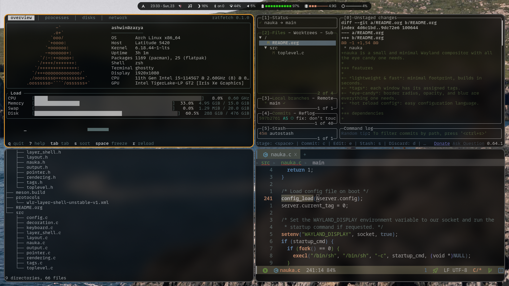

* nauka

nauka is a small and minimal Wayland compositor with all the eye candy one needs.

** features

- *lightweight & fast*: minimal footprint, builds in seconds.
- *tags*: each window has its assigned tags.
- *eye-candy*: border radius, opacity, and blur are everything one needs.
- *hot reload config*: easy configuration language.

** dependencies

- meson *
- ninja *
- wayland-protocols *
- wayland
- wlroots
- libinput
- libdrm
- pixman
- libxkbcommon
- libseat
- scenefx

> * compile-time dependencies

** building

#+begin_src bash
git clone https://github.com/shadowash8/nauka
cd nauka
meson setup build
ninja -C build
#+end_src

** usage

#+begin_src bash
nauka [-s]

-s for startup script
#+end_src

** configuration
configuration is loaded from:
- =$XDG_CONFIG_HOME/nauka/nauka.conf=
- =$HOME/.config/nauka/nauka.conf=

if no configuration file is found, nauka will use its built-in defaults.
for an example configuration, see =default.conf= in the repository.

the configuration file supports hot reloading, so changes can be
applied without restarting nauka.
